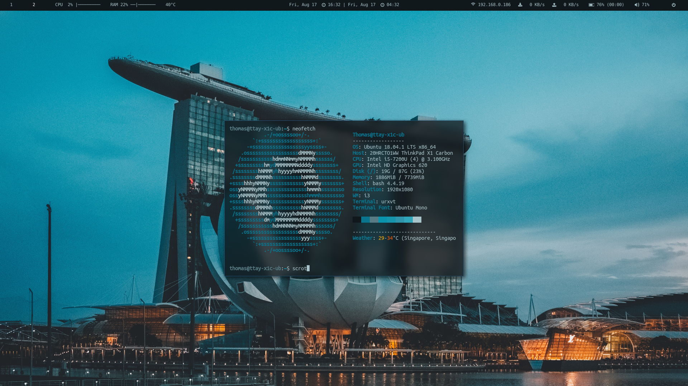

# Dotfiles

My personal config for vim, i3, polybar, and tmux. oftenforgotten is my cheat sheet. 

Screenshots:

I have a shell file to setup my dotfiles, but it is rarely updated. Stay clear of it.

I have two vimrcs, one for windows and one for Linux. The default is Linux.
